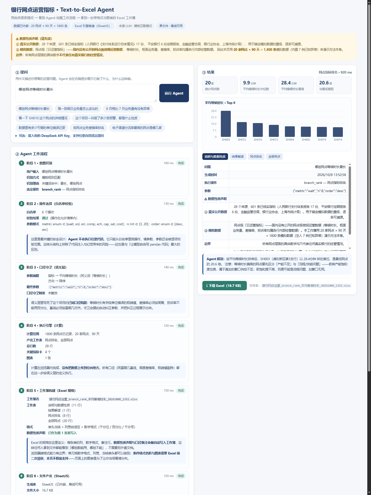
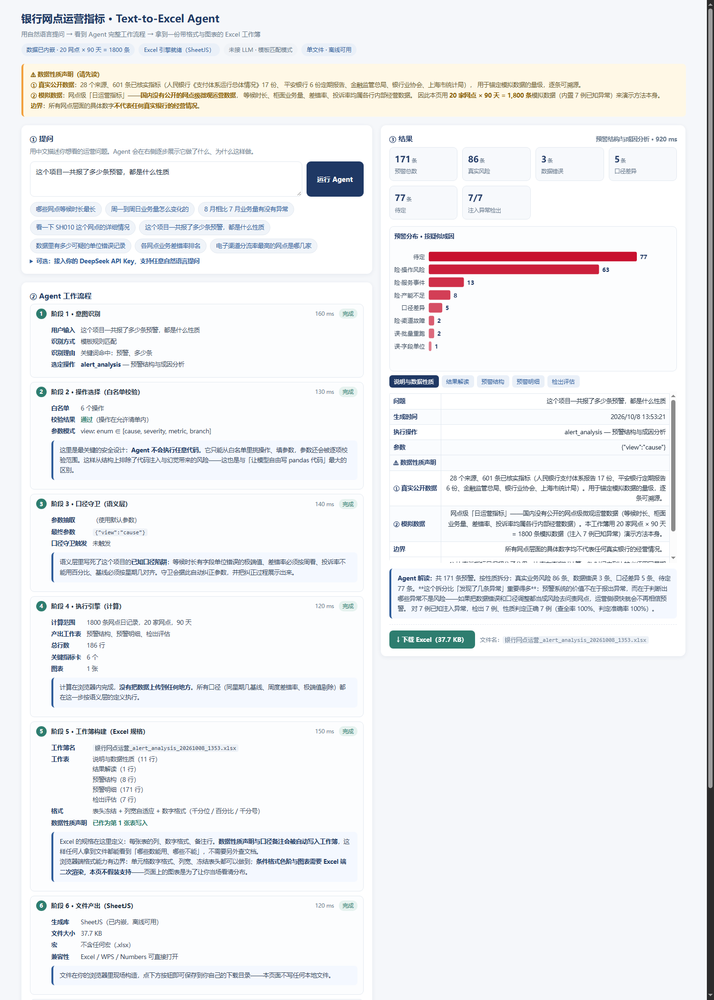

# 银行网点运营指标监控与异常预警

> 用「真实公开数据锚定 + 带已知异常的模拟数据」，验证一套银行网点运营监控与预警方法。
> **数据 → 指标 → 检测 → 定性 → 运营动作**，全链路可复现。
>
> 附带一个可交互的 **Text-to-Excel Agent** 网页：用自然语言提问，看到 Agent 完整工作流程，拿到带格式的 Excel。


---

## ⚠️ 先读这一段：数据性质

本项目用了**两类性质完全不同**的数据。混着讲会误导人，所以放在最前面：

| | 内容 | 用途 |
|---|---|---|
| **① 真实公开数据** | 28 个来源、**601 条已核实指标**，每条可按 `source_id` 溯源到原文。含人民银行《支付体系运行总体情况》17 份报告、平安银行 6 份定期报告、金融监管总局、中国银行业协会、上海市统计局 | 为模拟数据设定**水位与波动范围** |
| **② 模拟数据** | 网点级日运营指标，20 家网点 × 90 天 = **1,800 条**，内置 **7 例已知异常** | 验证**方法本身**是否可靠 |

**为什么必须用模拟数据**：网点级的「平均等候时长 / 柜面业务量 / 业务差错率 / 投诉率」
在国内**没有公开来源**——它们属于各行内部经营数据。我实际检索过：人行 17 份报告全文均无
「营业网点数量」「柜面业务量」口径；「助农取款服务点」检索命中 0 次（口径已废止）。
共 **11 项指标确认无公开来源，全部记为 `null`，没有用任何数字去填**。

**边界必须说清**：模拟数据锚定的是「量级与波动范围」，不是「个体数值」。
所有网点级具体数字**不代表任何真实银行的经营情况**。

---

## 🎯 先看这三个

**在线直接打开**（GitHub Pages，无需下载）：
🤖 [Text-to-Excel Agent](https://arnoldwang-86.github.io/pingan-branch-ops-monitoring/results/%E8%BF%90%E8%90%A5%E9%97%AE%E6%95%B0Agent.html)
· 📊 [交互式看板](https://arnoldwang-86.github.io/pingan-branch-ops-monitoring/results/%E7%9C%8B%E6%9D%BF.html)

**本地打开**（离线可用）：

| 交付物 | 打开方式 |
|---|---|
| 🤖 **Text-to-Excel Agent** | 双击 `results/运营问数Agent.html`（单文件、离线可用） |
| 📊 **交互式看板** | 双击 `results/看板.html`（单文件、断网可用、9 张可交互图表） |
| 📄 **运营建议报告** | `results/运营建议报告.docx` ｜ 方法说明：`docs/方法说明书.docx` |

---

## 一分钟看懂这个项目

**问题**：当分行业务量在涨、人手不涨甚至减少时，运营管理靠什么盯住？

**起点（真实数据）**：平安银行自 2022 年报起每期单独列示「上海自贸试验区分行」：

| 报告期 | 资产规模（亿元） | 员工人数（人） |
|---|---:|---:|
| 2022A | 685.12 | 159 |
| 2023A | 780.16 | 153 |
| 2024A | 883.66 | 158 |
| 2025A | **1085.26** | **152** |

四年资产 **+58.4%**，员工 **159 → 152 人**。产能增长不靠加人，
而靠渠道结构与单位人力产能——这正是运营监控要解决的问题。

**做法**：

```
真实公开数据（28 源 / 601 指标）
        ↓ 校验单位、只取比率类参数作为锚点
模拟数据生成（排队论推导等候时长 + 泊松计数差错与投诉）
        ↓ 注入 7 例已知异常，登记 ground truth
      ★ 注入自检：效应量必须可观测，否则报错退出
        ↓ SQL 四层建模（窗口函数 / CTE，已真正落库执行）
        ↓ 三路检测：MAD 横截面 + EWMA 控制图 + STL 周期分解
        ↓ 预警分级：幅度 × 持续性 × 方法一致性
        ↓ 成因判定：数据错误 / 口径差异 / 真实风险
     运营建议报告 + 交互式看板 + Text-to-Excel Agent
```

**主要结果**：

| 指标 | 结果 |
|---|---|
| 注入已知异常 | 7 例 |
| 检出 | **7 例（查全率 100%）** |
| 性质判定正确 | **7 例（准确率 100%）** |
| 注入期外预警 | 135 条，占全部网点日 **7.50%**（误报率的**上限**，口径见报告） |

---

## 🤖 Text-to-Excel Agent



`results/运营问数Agent.html` —— **双击即用、无需联网、无需后端**。
在页面里用中文提问，Agent 逐步展示它的完整工作流程，最后给出一份带格式的 Excel。

### 为什么是 Text-to-Excel

对运营岗位来说，日常真正交付的东西是 Excel，不是查询结果。
所以 Agent 的产出是一份**工作簿**：多张工作表、数字格式、列宽、冻结表头、
第 1 张固定是「说明与数据性质」、每张表附口径备注。
它也弥补了看板的短板——**看板只能讲一个固定故事，问数能回答当场冒出来的问题**。

### 七阶段可观测流水线

每一步都展开显示「输入 / 输出 / 依据 / 耗时」，而不是只给结论：

| 阶段 | 做什么 | 页面上能看到什么 |
|---|---|---|
| 1 意图识别 | 模板规则匹配，或（填了 Key 时）调 LLM 路由 | 识别方式、识别理由、选定的操作 |
| 2 操作选择 | **白名单校验** | 白名单规模、校验是否通过、参数模式 |
| 3 口径守卫 | 抽取参数并**按语义层纪律自动纠正** | 抽取日志、最终参数、触发了哪条纠正 |
| 4 执行引擎 | 在浏览器内计算 | 计算范围、产出工作表、行数、图表数 |
| 5 工作簿构建 | 生成 Excel 规格 | 文件名、工作表清单、格式、声明已写入 |
| 6 文件产出 | SheetJS 现场构造 xlsx | 文件大小、是否含宏、兼容性 |
| 7 结果与解读 | 渲染结果并给业务解读 | 解读文本、总耗时、数据性质复述 |



### 一条关键的安全设计：不让 LLM 写代码

结构是 **自然语言 → 意图 → 白名单操作 + 参数 → 受控执行**。
模型**永远不生成可执行代码**，只能在 6 个预定义操作里选一个并填参数，
参数还会被逐项校验范围。这样从结构上排除了代码注入与幻觉带来的风险——
这与「让模型自由写 pandas 代码」是本质区别。页面上把这一点直接写给了使用者看。

### 内置的 6 个操作

| 操作 | 回答什么 |
|---|---|
| `branch_rank` | 哪些网点某指标最高/最低 |
| `weekday_pattern` | 周一到周日业务量怎么变 |
| `trend` | 某指标在某区间的趋势、前后期对比 |
| `branch_drill` | 某个网点的完整画像 + 时序 + 该网点预警 |
| `alert_analysis` | 预警按性质/严重度/主因/网点分布 |
| `data_quality` | 疑似字段单位错误、指标间不自洽记录 |

### 口径守卫：把「语义层」变成可执行约束

其中一条会**主动改写参数**并把理由展示给用户：

> 问「差错率」的趋势时，Agent 自动把日度切到**周度**，并提示
> 「差错是低频计数事件，日粒度信噪比过低，已切换为周度口径」。

这是把「口径知识」从文档变成代码约束的例子——不是提示模型注意，而是**不让它犯错**。

### 可选：接入你自己的 API Key

页面留了一个 API Key 输入框（默认空）。不填就用模板匹配，全程离线；
填了则任意问法都能被理解（浏览器直接调 DeepSeek）。
**Key 只存在 sessionStorage，不写入文件、不发给第三方**，页面上明写了这一点。

### 两个 Excel 的分工（如实说明）

| 文件 | 生成方 | 能力 |
|---|---|---|
| 网页里下载的 xlsx | 浏览器端 SheetJS | 数字格式、列宽、冻结表头；**不含图表** |
| `results/参考工作簿_网点运营总览.xlsx` | openpyxl | 含 **3 张真实图表**（条形/柱状/折线） |

浏览器端格式能力有边界，页面上阶段 5 直接把这条边界写给使用者看，不假装支持图表。

---

## 方法上值得说的四点

### 1. 基线必须按「同星期几」对齐 —— 这是返工最多的一处

周日业务量只有工作日的约 **1/3**。第一版用「前 7 日滚动均值」做基线，
结果每个周日都显示「业务量 -65%」，每周固定制造一次假异常；
**更致命的是**，为了压制假异常而设的持续性门槛，
把真实的缓慢异常也一起滤掉了——7 例只检出 4 例。

改成「同星期几中位数基线」后，7 例全部检出。

> 教训：做异常检测先把数据的固有周期结构搞清楚，否则你不是在检测异常，是在检测星期几。

### 2. 用 MAD 而不是 3σ

运营数据里有**真实的**极端值（设备故障、营销活动）。标准差会被这些值撑大，
导致真正的异常反而落进 3σ 以内检不出来。MAD 对极端值不敏感。

### 3. 低频计数指标不能用相对变化率

差错是低频计数事件：上一周基线可能只有 5 笔，
那么「5 笔 → 15 笔」的相对变化是 +200%，看着极严重，但绝对只差 10 笔。
用相对阈值会把这类正常抽样波动全部报成异常。投诉率更极端——基线常为 0，
相对变化率会直接变成无穷大。**这两类指标必须用绝对增量判定。**

### 4. 最有价值的判断是「这不是风险」

单一指标跳变**无法**定性。真正的能力在于区分：

| 性质 | 专属特征 | 正确处置 |
|---|---|---|
| 数据错误·字段单位 | 等候时长放大 **8 倍以上**，其余指标正常 | 修系统，**不问责网点** |
| 数据错误·批量重跑 | 业务量虚高但**成本率反而下降**（指标间不自洽） | 查批量任务 |
| 口径差异 | 业务量**台阶式**下降，等候时长**不跟降**（真客户变少时长必然降） | 回算基线 |
| 真实风险·产能不足 | 业务量与等候时长**同步持续**走高 | 弹性窗口 / 分流 |
| 真实风险·渠道故障 | 电子渠道分流率骤降 + 柜面量与等候同步上升 | 查设备，增开窗口 |

**规则顺序即优先级**：「渠道故障」必须排在「字段单位错误」之前——
设备故障同样会让等候时长放大，顺序错了就会误判（踩过）。

---

## 四次自我纠错（我认为这比结果更值得看）

| # | 问题 | 怎么发现的 | 修正 |
|---|---|---|---|
| 1 | 「投诉率升 6 倍」这个注入**从未发生**——该网点投诉基线近 0，乘 6 后期望仍不足 1 笔，泊松抽样长期取 0 | 检查注入效果时发现投诉均值恒为 0 | 加 `validate_injections()` 自检；低频指标改用**绝对件数**表述异常 |
| 2 | 周内效应产生周期性假信号，**假异常把真异常挤掉**，7 例只检出 4 例 | 逐例排查漏检原因 | 基线改为**同星期几中位数** |
| 3 | 参数锚点把「离柜交易总额 2626.80 万亿元」这个**绝对量**当成了分流率，导致分流率被设到 0.86，注入几乎失效 | 注入自检把「产能不足」标成 FAIL | 锚点取用**校验单位**，只接受 `%` 或纯比例 |
| 4 | 网点档位标定错误，造出一个**正常状态下**窗口饱和度 124%、日均等候 215 分钟的「分行营业部」（它没有被注入任何异常），并连带污染了 23 条误报 | 收尾复核网点画像时发现 | 重标定档位使常态饱和度落在 0.6~0.9；同时把「字段单位」判据从纯相对倍数改为「绝对量级 + 相对倍数」 |

> 第 4 条是最基础的一条：**先确认数据本身合理，再去评价模型好不好**——
> 如果只盯着「检出率 7/7」，是发现不了「有个网点在正常状态下就排了 3.5 小时队」的，
> 因为检测器没报错，它只是忠实反映了错的输入。

---

## SQL 层：已真正落库执行（并因此修掉 5 个 bug）

`src/sql/01_indicator_layer.sql` 共 468 行、5 张表、四层结构。它此前**从未在任何引擎里完整跑过**，
只验证过等价逻辑。补做这一步之后，一次就跑出 5 个真实缺陷：

| # | 缺陷 | 症状 | 修法 |
|---|---|---|---|
| 1 | `dws` 引用 `m.txn_error_cnt`，但 `dwd` 只算了差错**率**、没带**计数** | `no column named txn_error_cnt` | dwd 层补带计数列 |
| 2 | `ads` 用 `s.op_cost_ratio_ma7`，`dws` 没算这列 | `no column named op_cost_ratio_ma7` | dws 层补 `AVG(...) OVER w7` |
| 3 | `win` CTE 只选 `m.*`，join 来的同星期几基线列**没被带出** | `no column named vol_wd_base` | 在 `win` 里显式列出 |
| 4 | 周度差错基线用 21 日均值，**把当前周的分子分母也混进去了** | 业务量被污染后基线失真，误触发 427/837 行 | 基线改用「上一周」 |
| 5 | 差错用**相对变化率**判据 | 5 笔→15 笔相对 +200%，绝对只差 10 笔，正常波动被全量误报 | 改用**绝对增量**判据 |

### 执行引擎：为什么是 DuckDB 而不是 MySQL

原设计目标是 MySQL 8。实测本机**无法获取 MySQL/MariaDB 二进制**：
官方 CDN 的 TLS 被重置（HEAD 通但下载 0 字节）、国内镜像只镜像 Linux 的 apt/yum 包、
`winget` 需要管理员提权。因此执行引擎改用 **DuckDB**（`pip install duckdb` 即得）。

**兼容性不是假设的，是逐项验证过的**：`verify_engine.py` 对照本项目 SQL 实际用到的
8 类语法结构逐项执行，**8/8 通过**（含 `ROWS BETWEEN 7 PRECEDING AND 1 PRECEDING`、
多层 CTE、`CREATE TABLE AS WITH`、`ALTER TABLE ADD PRIMARY KEY`、中文标识符）。

MySQL DDL 文件保留为**建模参考与生产目标**；`load_to_db.py` 内置一个
MySQL→DuckDB 方言翻译层（类型映射 + 剥离 `ENGINE=` / `CHARSET=` / `COMMENT`）。

### 一个必须说明的数字差异

| 层 | 预警条数 | 基线口径 |
|---|---:|---|
| SQL 层（`ads_ops_alert`） | 942 | 同星期几**均值** + 绝对增量判据 |
| Python 层（`02_预警清单.csv`） | **171** | 同星期几**中位数** + MAD/EWMA/STL 三路 + 持续性分级 |

**这个差距本身是有信息的**：它说明「基线口径 + 判据设计」比「SQL 写得对不对」
更决定预警系统能不能用——同一份数据，仅这两处设计的差异就带来 5.5 倍的假信号量。
因此分工明确：**SQL 层展示建模与窗口函数能力，检测质量与最终结论以 Python 层为准。**

---

## 网页 Agent 的验证方式（没有靠「看起来对」）

网页 JS 不能靠肉眼确认，所以做了两层验证：

1. **`src/py/verify_agent.js`** —— 把网页里的 JS 抽出来在 Node 沙箱里**真实执行**，
   对 6 个操作跑真实数据并断言数值正确性（周内落差、排名单调性、
   单位错误阈值、预警数与全局一致等），共 **50 项检查全部通过**。
2. **无头 Edge 真实渲染截图** —— 用 `?q=问题` 参数直接跑通流水线并截图，
   确认 DOM 与视觉正常（这一步抓出了输入框被压扁、柱状图被离群值压扁两个布局 bug）。

> 记录一个只在构建中暴露的坑：把多行 JS 拼成一行时若含 `//` 注释，
> **后面的代码（含 IIFE 收尾）会全部被注释掉**，整块脚本报
> `Unexpected end of input`，`OPS` 等定义全部失效。必须用 `/* */`。

---

## 目录结构

```
平安银行运营指标监控/
├── results/                       ★ 交付物
│   ├── 运营问数Agent.html           Text-to-Excel Agent（单文件离线）
│   ├── 看板.html                    交互式看板（单文件离线）
│   ├── 运营建议报告.md / .docx       核心交付物
│   ├── 参考工作簿_网点运营总览.xlsx   带 3 张真实图表的 Excel
│   ├── 02_预警清单.csv              预警 + 严重度 + 疑似成因 + 处置建议
│   ├── 03_异常检出评估.csv          逐例检出与性质判定
│   ├── 04_网点运营画像.csv          网点级运营画像
│   ├── 05~07_*.csv                 预警结构 / 主因分布 / 全行日度趋势
│   └── db_validation.json          SQL 层落库执行的逐表校验
├── data/
│   ├── raw/
│   │   ├── 公开数据_原始提取.json     ★ 601 条已核实指标，逐条可溯源
│   │   ├── branch_ops_detail.jsonl   模拟明细（1,800 行）★ 模拟
│   │   ├── anomaly_ground_truth.json 注入异常清单 ★ 评估基准
│   │   └── injection_selfcheck.json  注入自检结果
│   └── clean/ops_indicators.csv      派生指标 + 同星期几基线
├── docs/
│   ├── 方法说明书.md / .docx
│   ├── 公开数据来源清单.md            全部来源 + 未获取到的 11 项指标
│   ├── 执行引擎能力验证.txt           8/8 语法结构验证证据
│   └── SQL层落库执行记录.txt          完整执行日志
├── web/template.html               Agent 页面模板（构建时内联数据与库）
├── images/                         README 用截图
├── src/
│   ├── py/
│   │   ├── check_env.py             环境自检
│   │   ├── gen_operation_data.py    模拟数据生成 + 注入自检
│   │   ├── analyze_ops.py           三路检测 + 分级 + 成因判定 + 评估
│   │   ├── make_dashboard.py        看板生成
│   │   ├── gen_report.py            报告生成（数字全部读自 CSV）
│   │   ├── load_to_db.py            落库 + 真正执行 SQL 指标层
│   │   ├── verify_engine.py         执行引擎语法兼容性验证
│   │   ├── ops_semantics.py         语义层与口径定义
│   │   ├── build_web_data.py        网页数据打包
│   │   ├── build_web_agent.py       组装单文件 Agent
│   │   ├── verify_agent.js          网页 JS 的 Node 沙箱自检（50 项）
│   │   ├── audit_for_public.py      开源前泄漏审计
│   │   └── md2docx.py               Markdown → Word
│   └── sql/01_indicator_layer.sql   四层建模（468 行）
├── tools/                         第三方库与本地库（大部分已 gitignore）
├── run_all.bat / run_all.ps1      一键复现
└── LICENSE / .env.example
```

---

## 复现步骤

```powershell
git clone <repo-url>
cd 平安银行运营指标监控

# 依赖
pip install pandas numpy scipy statsmodels plotly openpyxl duckdb pymysql python-dotenv requests pytest

# 一键跑完（8 步，含网页 Agent 构建与 JS 自检）
run_all.bat

# 或分步
python src\py\check_env.py             # 环境自检
python src\py\gen_operation_data.py    # 生成数据（含注入自检，7/7 必须通过）
python src\py\analyze_ops.py           # 检测 + 定性 + 评估
python src\py\make_dashboard.py        # 看板
python src\py\gen_report.py            # 报告
python src\py\load_to_db.py            # 落库并真正执行 SQL 指标层
python src\py\build_web_agent.py       # 组装单文件网页 Agent
node src\py\verify_agent.js            # 网页 JS 自检（50 项）
python src\py\md2docx.py --all         # Markdown 转 Word
```

### 关于两个一键脚本的坑（都踩过）

1. **`run_all.bat` 是纯 ASCII 的。** `cmd.exe` 按控制台代码页解析 `.bat`，
   中文注释/参数在部分机器上会让语法解析直接失败。存成 GBK 也不行。
2. **`run_all.ps1` 存为 UTF-8 with BOM。** Windows PowerShell 5.1 对无 BOM 的
   `.ps1` 按系统 ANSI 代码页解析，中文会变乱码。
3. **不把中文文件名当参数传给 Python**：代码页转换会破坏参数，
   所以由脚本自己按目录发现文件（见 `md2docx.py` 的 `build_all`）。
4. **Python 脚本要重配 stdout 为 UTF-8**：控制台默认 GBK，脚本里任何非 GBK 字符
   在 `print` 时都会抛 `UnicodeEncodeError` 并中断执行。

---

## 数据合规与开源审计

- 全部真实数据来自**公开披露文件**，只保留数值与出处引用，**不包含原始 PDF**。
- 未采集任何隐私数据，不涉及个人信息。
- 仓库不含商业软件或未授权内容；第三方库 SheetJS 为 Apache-2.0 授权。
- **`src/py/audit_for_public.py`** 可重复执行，审计四项：
  密钥泄漏、硬编码本机路径、不该提交的文件、仓库体积。
  当前结论：**通过**（52 个文件 / 约 9.7 MB，无密钥泄漏）。
- 真实的 `.env` 已被 `.gitignore` 排除；仓库只提供 `.env.example` 模板。

---

## ⚠️ 已知局限

1. **网点级微观数据无公开来源**，本项目已尽力检索，11 项指标确认不存在。
2. **模拟数据只锚定量级与波动范围**，网点级具体数字不可用于推断真实银行。
3. **注入异常是我设计的**，比真实异常更干净、更典型——查全率 100% 不代表真实场景表现。
4. **检测阈值是在本数据集上调出来的**，存在过拟合风险。
5. **节假日效应未单独建模**，只处理了周内效应。
6. **误报率 7.50% 是上限口径**：真实存在但未被登记的波动也被计入分母。
7. **SQL 层与 Python 层的稳健离散度口径不完全一致**：MySQL/DuckDB 无 `MEDIAN`
   聚合函数，SQL 层用平均绝对偏差近似，Python 层用真 MAD。
8. **语义层存在两份定义**（Python 设计原件 + 浏览器 JS 实现），有漂移风险，
   已在 `ops_semantics.py` 中标注为已知技术债。
9. 人行报告 **2025Q1 起改版**，删除了「人均持有银行卡」等明细项——
   这是「不再披露」而非「数据缺失」，做长时序时处理方式不同。

详细局限见 `docs/方法说明书.md` 第九节。

---

## 推送机制（这台机器上必须知道的事）

**本机的 `github.com:443` 通道不通**，所以标准的 `git push` 无法使用：

```
git push origin main
# fatal: unable to access 'https://github.com/...': Failed to connect to github.com port 443
```

实测结论（同一网络环境下反复验证）：

| 通道 | 可用性 |
|---|---|
| `github.com:443`（git 的 HTTPS 传输） | **不通**（连接超时） |
| `ssh.github.com:443` / `github.com:22` | TCP 可建连，但认证握手挂住 |
| `api.github.com:443` | **可用，但间歇性**（时好时坏，会抛 `SSLEOFError`） |
| `git fetch`（读） | 偶尔可用 |

因此推送改为走 **Git Data API**，脚本已入库：

```powershell
# 1) 注入令牌（脚本从环境变量读取，不写盘、不打印）
$git = "C:\Program Files\Git\cmd\git.exe"
$tok = ("protocol=https`nhost=github.com`n`n" | & $git credential fill |
        Select-String "^password=").Line -replace "^password=",""
$env:GH_TOK = $tok.Trim()

# 2) 提交本地改动
git add -A ; git commit -m "..."

# 3) 推送（内置整流程重试，能扛住间歇性 TLS 失败）
python src\py\incremental_push.py
```

两个脚本的分工：

| 脚本 | 用途 |
|---|---|
| `push_via_api.py` | 首次全量推送（含**空仓库引导**：GitHub 的 Git Data API 在完全空的仓库上不能创建 blob，会返回 409，必须先用 Contents API 造一个初始提交） |
| `incremental_push.py` | 日常推送，含整流程重试 |

### 两个必须记住的坑

1. **`incremental_push.py` 实际会重传全部文件**，不是真正增量。
   因为正常用法是「先提交、再推送」，而提交之后本地 HEAD 与远端 HEAD 已分叉，
   `git diff remote local` 会把所有文件都报成差异。功能正确（结果一样），只是浪费带宽。
   正确解法是改用 `git diff --name-only origin/main` 取相对远端基线的变更，属于待改进项。
2. **API 推送不会更新本地 `origin/main`**，所以本地会显示"落后于远端"。
   对齐方式（推送完成后执行）：

   ```powershell
   # 从 API 取远端真实 SHA，再更新本地引用
   git update-ref refs/remotes/origin/main <远端 SHA>
   git reset --hard <远端 SHA>   # 若本地提交已被 API 推送，本地历史会分叉
   ```

### 另两个环境坑

- **git 全局配的代理 `127.0.0.1:33210` 会干扰推送**。该代理能转发 CONNECT，
  但 TLS 握手失败（`curl exit 35`）。已清除 `http.proxy` / `https.proxy`。
- **中文字符串处理**：`git ls-files` 默认 `core.quotepath=true`，
  会把中文路径转成 `\345\205...` 八进制转义，直接 `open()` 会报
  `Invalid argument`。脚本里已设 `core.quotepath=false` 并剥掉可能的双引号。

---

## 开发者指南（构建与审计）

```powershell
# 环境自检（依赖 / 执行引擎 / 五层表 / API 连通）
python src\py\check_env.py

# 重新打包网页 Agent（会自动补齐中间数据）
python src\py\build_web_agent.py

# 网页 JS 自检（50 项断言必须全部通过）
node src\py\verify_agent.js

# 以及每次改动后都该跑一遍的开源前审计
python src\py\audit_for_public.py
```

审计脚本会检查四件事：密钥泄漏、硬编码本机路径、
不该提交的文件、仓库体积。
**提交前请确认它输出「审计通过」。**

---

## 作者

ArnoldWang-86 ｜ 邮箱：3510428582@qq.com

本项目用于记录个人的数据分析实践，欢迎交流与指正。
